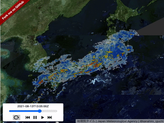

# maplibre-gl-temporal-control



## examples

-   RasterTiles: https://kanahiro.github.io/maplibre-gl-temporal-control/raster.html
-   VectorTiles: https://kanahiro.github.io/maplibre-gl-temporal-control/vector.html

## usage

```sh
npm install maplibre-gl-temporal-control
```

```typescript

const layers = [
    {
    id: 'layer-1',
    type: 'raster',
    source: 'raster-source-1',
    // ...
    },
    {
    id: 'layer-2',
    type: 'raster',
    source: 'raster-source-2',
    // ...
    },
    {
    id: 'layer-3',
    type: 'vector',
    source: 'vector-source-1',
    // ...
    }
    // ...
];

const map = new maplibregl.Map(mapOptions)

// maplibre layer-object
map.addLayer(layers[0])
map.addLayer(layers[1])
map.addLayer(layers[2])
// ...

import TemporalControl from 'maplibre-gl-temporal-control';

const temporalFrames = [
    {
        title:'frame1', // shown on control panel
        layers:[layers[0]] // set layers you want to show at one frame...
    },
    {
        title:'frame2',
        layers:[layers[1], layers[2]]
    },
    // ...
]

const temporalControl = new TemporalControl(temporalFrames, {
    position: 'top-left',
    interval: 100, // duration a frame is shown, in miliseconds
    loopDelay: 1000, // delay before looping, in miliseconds
    showButtons: true, // show/hide buttons in control
    loop: false, // whether to loop the animation by default
    autoplay: false, // whether to start playing the animation by default
    // increase rendering performance by pre-loading all layers by using a low opacity instead of hiding non-visible layers)
    performance: true,
    opacity: 1, // opacity of layers.
    initialFrameIndex: 0, // initial frame index
    onUpdate: (frameIndex) => {
        // callback when frame is changed
    }
});
map.addControl(temporalControl);

// optionally change frame from outside of the control
temporalControl.setFrame(1);
// optionally set the opacity of the layers from outside of the control
temporalControl.setOpacity(0.5);

```

### Tips

-   In frames, You must set layer-objects corresponding to in map.
-   Layers set in frames must be added in map
-   when `performance: true`, not-current frames are shown as opacity=0.000000000000000000001
    -   this option may not be necessary for ordinary usecases
